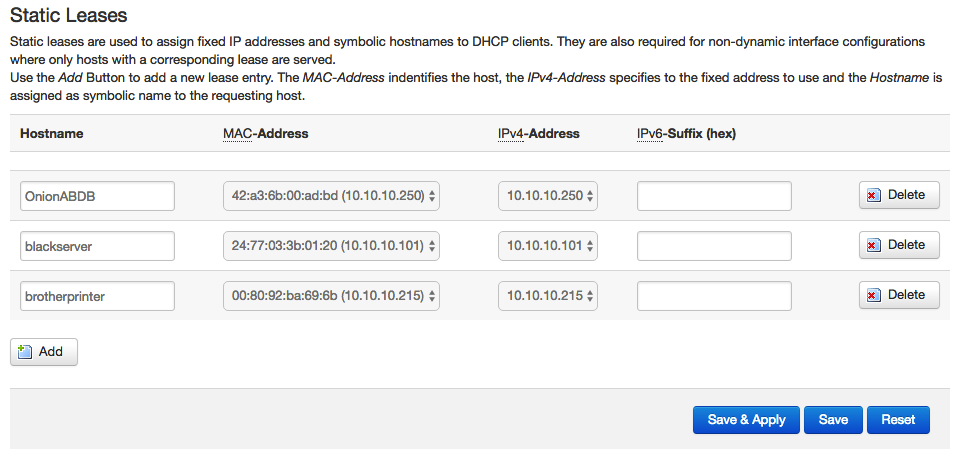

# Experiments and Notes for Onion Omega2+

This repo will contain experiments I do with my Omega2+ as well as some notes for doing various things.

I exclusively use `vi` in this documentation, you may substitute `nano` after installing it.

My Omega's IP address is shown in examples here as `10.10.10.250`, you'll need to substitute your own IP address.

My client machine is OSX or Linux, I don't really know how to do anything on Windows any more, I have not really used MS products since WinXP.  These instructions are geared toward using the shell in those operating systems, you can install [VirtualBox](https://www.virtualbox.org/wiki/Downloads) and Linux in your Windows OS and play along if you'd like.

## Experiments

I've just been messing with the OS, there's nothing here yet.

Eventually you'll be able to clone this to your Omega and mess around with it.

## Update Firmware from Command Line

**Updating your firmware may wipe your device, probably good to just assume it will.**

The update images for the device are hosted on [onion.io](http://repo.onion.io/omega2/images/).  You can use `oupgrade` to automagically update your firmware.

    oupgrade --help
    
    Functionality:
      Check if new Onion firmware is available and perform upgrade

    Usage: /usr/bin/oupgrade

    Arguments:
     -h, --help        Print this usage prompt
     -v, --version     Just print the current firmware version
     -l, --latest      Use latest repo version (instead of stable version)
     -f, --force       Force the upgrade, regardless of versions
     -c, --check       Only compare versions, do not actually update
     -u, --ubus        Script outputs only json

You can force upgrade to a specific version with `sysupgrade`.  At this writing `v0.1.9-b157` was the latest version.

    wget -P /tmp http://repo.onion.io/omega2/images/omega2p-v0.1.9-b157.bin 
    sysupgrade -n /tmp/omega2p-v0.1.9-b157.bin

This will output something like this and eventually your connection will be broken.

    killall: watchdog: no process killed
    Sending TERM to remaining processes ... uhttpd device-client avahi-daemon onion-helper udhcpc udhcpc packet_write_wait: 
    Connection to 10.10.10.250 port 22: Broken pipe
    
Don't turn the device off while it is updating or you could brick it.  There is an article on possibly unbricking your device on the [community page](https://community.onion.io/topic/1154/omega-2-usb-firmware-install-after-brick-resolved/4).

After you update you will need to delete the device from your local `~/.ssh/known_hosts` file.

## Wifi Setup from Command Line

Plug your Omega in and from your computer connect to the wifi network it created.  Then SSH into it.  The standard IP address is always `192.168.3.1`.

    ssh root@192.168.3.1

You can use the `wifisetup` command to configure your wifi without the web interface.

    root@Omega-ADBD:~# wifisetup
    Onion Omega Wifi Setup

    Select from the following:
    1) Scan for Wifi networks
    2) Type network info
    q) Exit

    Selection:

If you are not hiding your SSID, select `1`, otherwise you can manually enter it with `2`.

    Selection: 1
    Scanning for wifi networks...

    Select Wifi network:
    1) Neighbor's Network 1
    2) Neighbor's Network 2
    3) Neighbor's Network 3
    4) Neighbor's Network 4
    5) Whatever You Named Your Network
    6) Neighbor's Network 5
    7) Neighbor's Network 6
    8) Neighbor's Network 7

Select your network.

    Selection: 5
    Network: Whatever You Named Your Network
    Authentication type: WPA2PSK
    Enter password: Your_Password_Here

    > Restarting wifimanager for changes to take effect

This sometimes takes a bit to get an IP address, after it is done just reboot and exit to your shell.  You can use the `&&` to run a second command after the first is complete.

    reboot && exit

This should bring the device back up on your regular network.

## Forcing an IP Address in an OpenWRT Router

If you use an OpenWRT router and probably other routers you can setup a Static Lease to bind the Omega's MAC address to a specific IP.  This makes it easy to find your device on the network, if you happen to forget the IP address.

Login to your router's web interface and navigate to **Network** ⟶ **DHCP and DNS**.  Here at the bottom you should see *Static Leases* and you can add your Omega's specific MAC address and an IP address on your network.  Here is mine for example, you can see I have a server and a printer listed in there as well.

After you bind the MAC to the IP address, hit Save & Apply then reboot or power cycle your Omega.

## Install Some Packages

### Update the Package Manager

    opkg update

### Install GIT

    opkg install git
    opkg install git-http
    opkg install ca-bundle

### Install a Better Text Editor

    opkg install vim
    opkg install nano

### Install BASH

    opkg install bash
    vi /etc/passwd

Change this:

    root:x:0:0:root:/root:/bin/ash

To this:

    root:x:0:0:root:/root:/bin/bash

Log out of the Omega's shell and log back in for this to take effect.  You may test with:

    echo $SHELL

## Create Your `.profile`

Create your local bin.

    mkdir ~/bin

Touch your profile.

    touch ~/.profile

Edit it.

    vi ~/.profile

Add some stuff to it.

    alias l='ls -lah'
    export PATH=~/bin:$PATH
    
Source it, this applies the changes you made.

    source ~/.profile

## SSH

### Default Login / Password

If your device is going to be in the wild, be sure to change these.

    Username: root
    Password: onioneer
    

### Generate SSH Keys

    mkdir ~/.ssh
    dropbearkey -t rsa -f ~/.ssh/id_rsa
    dropbearkey -y -f ~/.ssh/id_rsa | sed -n 2p > ~/.ssh/id_rsa.pub

### SSH to Omega without Password

On your client machine, if you have not, generate a public and private key with `ssh-keygen`.  You may set a password if you'd like.

    ssh-keygen

Now cat the client's `id_rsa.pub` into your Omega, you'll need to change my IP to yours here.

    cat ~/.ssh/id_rsa.pub | ssh root@10.10.10.250 'cat >> /etc/dropbear/authorized_keys'

This will prompt for your Omega's password then throw an error, you can ignore the error.

    root@10.10.10.250's password:
    shell-init: error retrieving current directory: getcwd: cannot access parent directories: Not a tty

Now when you ssh from the client to the Omega it should not prompt you.

    root@10.10.10.250

## Setting Up Git

Full readme here: [docs/git_setup.md](docs/git_setup.md)

## Setting Up SDCARD for `/root` and SWAP

Full readme here: [docs/setting_up_sdcard_for_root_and_swap.md](docs/setting_up_sdcard_for_root_and_swap.md)

## Node.js

Install Node and NPM

    opkg install nodejs
    opkg install npm

I like to store my global node modules in my root directory, so as to not take up too much room in the root file system, this along with my instructions above for setting up SDCARD for `/root` gives me plenty of extra space.

    mkdir -p /root/node/bin
    npm config set prefix /root/node

Add the node bin to your `.profile`, either edit it or echo to it.

    echo "export PATH=~/node/bin:\$PATH" >> ~/.profile
    source ~/.profile

Test it out.

    npm install -g lorem-ipsum
    lorem-ipsum
    # should output some lorem ipsum text
    npm remove -g lorem-ipsum
    
## File Transfer

To send/receive files to/from the device I recommend using `scp`, you'll want to substitute your device's IP for the one I have listed.

    # Receive a single file from your etc to your local machine
    scp root@10.10.10.250:/etc/openwrt_release .
    
    # Receive a full directory from /www to your local machine
    scp -r root@10.10.10.250:/www .
    
    # Send a single file to your root directory
    scp localfile.txt root@10.10.10.250:~/
    
    # Send a full directory to your root directory
    scp -r /some_path root@10.10.10.250:~/
    

    