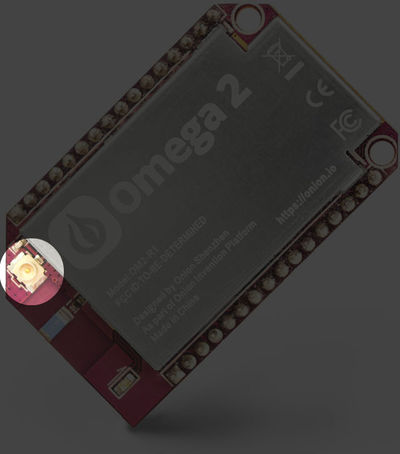
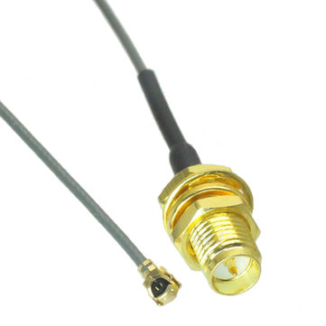
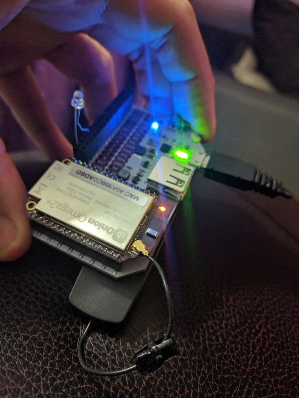

# External Antenna

You can add an external antenna to the device with the IPX jack on the main unit.

You can convert it to a standard wifi antenna with an **IPX to RP-SMA adapter**.  You can get these on [Amazon - ipx to rp-sma](https://goo.gl/yXCly5) or [eBay - ipx to rp-sma](https://goo.gl/BwT5Vr) or various other places.  

Otherwise you can use an IPX antenna, I used this one which I had laying around and afixed the antenna to the bottom of the unit.  You can get IPX antennas also from again [Amazon - IPX antenna](https://goo.gl/pWwB2Q) or [eBay - IPX antenna](https://goo.gl/uabwr6) or various other places.

## Speed Test

I used [speedtest-cli](https://github.com/sivel/speedtest-cli) to do these calculations.  You will need to install python with opkg if you want to use it.

[This reply](http://community.onion.io/topic/1464/omega2-u-fl-external-antenna-usage) to a thread about the external antenna about better throughput without a resistor.  I ran my experiments several ways.

My antenna is kind of crappy, so you may get faster results with a better one.

### External Antenna with Resistor

    ./speedtest-cli --server 1344
    Retrieving speedtest.net configuration...
    Testing from Verizon Fios (108.48.93.143)...
    Retrieving speedtest.net server list...
    Retrieving information for the selected server...
    Hosted by InfoRelay Online Systems (Reston, VA) [7.06 km]: 31.376 ms
    Testing download speed................................................................................
    Download: 20.10 Mbit/s
    Testing upload speed................................................................................................
    Upload: 27.77 Mbit/s

### External Antenna without Resistor

    ./speedtest-cli --server 1344
    Retrieving speedtest.net configuration...
    Testing from Verizon Fios (108.48.93.143)...
    Retrieving speedtest.net server list...
    Retrieving information for the selected server...
    Hosted by InfoRelay Online Systems (Reston, VA) [7.06 km]: 24.007 ms
    Testing download speed................................................................................
    Download: 19.54 Mbit/s
    Testing upload speed................................................................................................
    Upload: 19.03 Mbit/s

### No External Antenna with Resistor

    ./speedtest-cli --server 1344
    Retrieving speedtest.net configuration...
    Testing from Verizon Fios (108.48.93.143)...
    Retrieving speedtest.net server list...
    Retrieving information for the selected server...
    Hosted by InfoRelay Online Systems (Reston, VA) [7.06 km]: 23.796 ms
    Testing download speed................................................................................
    Download: 6.03 Mbit/s
    Testing upload speed................................................................................................
    Upload: 9.14 Mbit/s

### No External Antenna without Resistor

    ./speedtest-cli --server 1344
    Retrieving speedtest.net configuration...
    Testing from Verizon Fios (108.48.93.143)...
    Retrieving speedtest.net server list...
    Retrieving information for the selected server...
    Hosted by InfoRelay Online Systems (Reston, VA) [7.06 km]: 28.346 ms
    Testing download speed................................................................................
    Download: 1.94 Mbit/s
    Testing upload speed................................................................................................
    Upload: 3.42 Mbit/s

