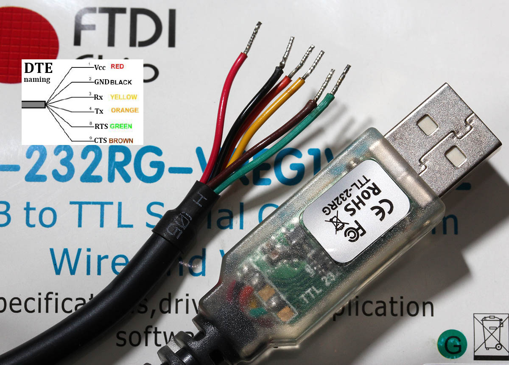
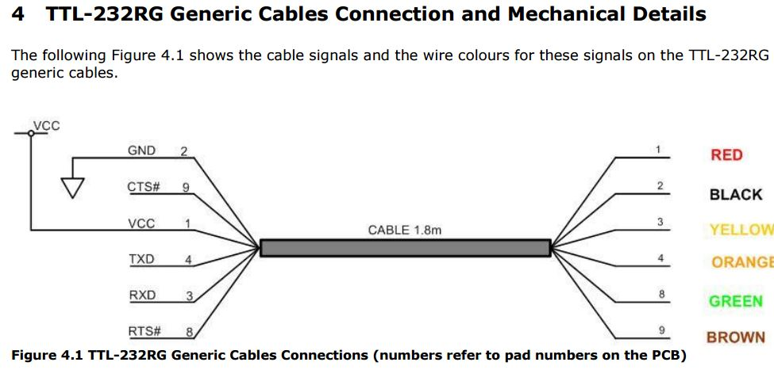
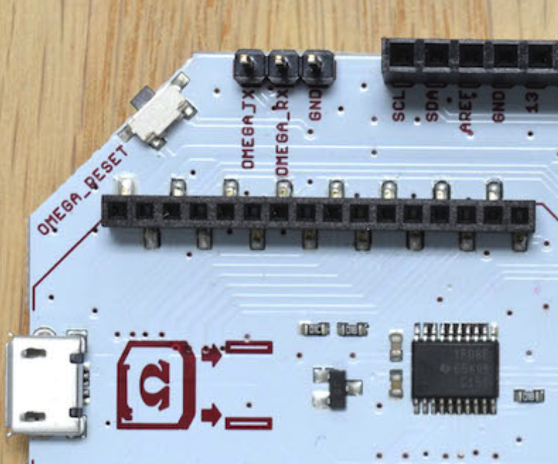

# Serial Connection

There aren't any specific directions as far as I can tell for connecting the Omega 2+ to get serial output.

## Serial-to-USB Connections

You'll need a Serial-to-USB cable, the specific model I'm using is a **TTL-232RG-VREG1V8-WE**.

You'll need a **ARDUINO DOCK**, suposedly you can do this with the **BREADBOARD DOCK** also, but I really have no idea how.

You'll need to connect the TTL-232RG to the Arduino Dock as such.

|Cable  |Desc |Arduino Dock|
|:------|:---:|-----------:|
|Black  |GND  |         GND|
|Yellow |RX   |    OMEGA_TX|
|Orange |TX   |    OMEGA_RX|

## Connecting via Serial

Open a terminal in linux and do:

    sudo screen /dev/ttyUSB0 115200

More directions for other operating systems may be found here: https://docs.onion.io/omega2-docs/connecting-to-the-omega-terminal.html#connecting-to-the-omega-terminal-serial

I usually would get to Onion's WARP CORE and then it would hang indefinitely.

    [   21.193807]
    [   21.193807]  _      _____   ___  ___    _________  ___  ____
    [   21.193807] | | /| / / _ | / _ \/ _ \  / ___/ __ \/ _ \/ __/ V1.0
    [   21.193807] | |/ |/ / __ |/ , _/ ___/ / /__/ /_/ / , _/ _/
    [   21.193807] |__/|__/_/ |_/_/|_/_/     \___/\____/_/|_/___/
    [   21.193807]             Onion Enhanced MT7688 WiFi Driver
    [   21.193807]
    [   27.998480] device ra0 entered promiscu[   30.005821] br-wlan: port 1(ra0) entered forwarding state

## End Game

I wound up throwing the device out after messing with this garbage for several hours. No matter what order I'd insert the plug and push the button, it would either come up and instantly decompress the kernel or go into an unusable failsafe mode or very rarely allow me to hit 2 to boot USB, though after hitting 2 it would look at the flash drive and hang or decompress the kernel.  I have a feeling these devices are basically fucking garbage.